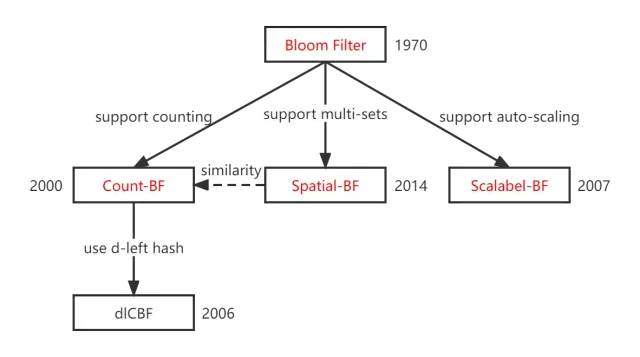

---
---

# Extended

## Count-BF

普通的布隆过滤器并不支持删除元素，因为多个元素可能哈希到一个布隆过滤器的同一个位置，如果直接删除该位置的元素，则会影响其他元素的判断。

因此，为了弥补这一缺点，在 2000 年的论文 [Summary Cache: A Scalable Wide-Area Web Cache Sharing Protocol](https://pages.cs.wisc.edu/%7Ejussara/papers/00ton.pdf) 中，Li Fan 等人设计了 Counting Bloom Filter。

原理：

1. 给定长度为 $m*N$bits 的位数组。$N$是用来存计数的位大小，论文中取 4，即最大计数$N_{max}$为 15。因为此时会溢出的概率已经足够小
2. 插入：选取$k$个哈希函数，每个哈希函数将给定的元素映射到$[0, m-1]$的一个位置上，并将该位对应的值$+1$。如果值大于$N_{max}$，则取$N_{max}$
3. 删除：选取$k$个哈希函数，每个哈希函数将给定的元素映射到$[0, m-1]$的一个位置上，并将该位对应的值$-1$。如果值小于$0$，则取$0$
4. 判断存在：和普通的布隆过滤器相同

因此 Count-BF 和普通 BF 的区别仅仅是：将原来的只能记 0/1 的一位，拓展为了多位。如果遇到哈希冲突，则把该位的值$+1$，删除时则将该位$-1$。

## dlCBF

思科联合哈佛大学和斯坦福大学于 2006 年提出，传统的 Count-BF 大部分时候值都为 0，非常浪费空间。因此在 [An Improved Construction for Counting Bloom Filters](https://theory.stanford.edu/~rinap/papers/esa2006b.pdf) 一文中，他们基于 [d-left hashing](https://programming.guide/2-left-hashing.html)，构建了名为 d-left Counting Bloom Filter 的空间利用率更高的布隆过滤器。与此同时，还提供了更小的误算率。

原理：

1. 将原本的 CBF 的一个哈希表(位数组)划分为$d$个子表；每个子表包含$w$个桶(bucket)；每个桶内又包含$c$个单元(cell)；每个单元存储一对哈希指纹和计数器`(fingerprint, counter)`
2. 计算规则：使用哈希函数，得到一个足够长的哈希值。将值映射为$(s_1, s_2, \dots, s_d, s_r)$段：
   - 高$s_1 \to s_d$段各占$b$ bits，分别对应$d$个子表中的桶索引，每个子表有$w=2^b$个桶，$\forall s_d \in [0,2^b-1]$
   - $s_r$段作为哈希指纹
3. 插入时，根据$s_1, s_2, \dots, s_d$定位到$d$个桶：
   - 如果某个单元已存在对应的哈希指纹，说明插入值已经插入过，则该单元的计数器$+1$
   - 如果都没有：选择$d$个桶中已有单元数量最少的一个桶，新增一个单元，写入$(s_r, 1)$。如果有多个单元数量少的(平局)，选最左的桶
4. 删除时：同样定位到$d$个桶，找到匹配指纹的单元，对应计数器$-1$；减到 0 时删除
5. 查询时，如果元素之前插入过，必然在某个桶里留下了指纹，则有：
   - 如果都不存在对应单元，则一定不存在
   - 如果有则有可能存在

可见，d-left 中的'd'表示将原来的哈希表拆分，而'left'描述选取桶位置的原则。从而使得数据的存储更加均匀和密集。

通过选择合适的指纹长度$r$和桶索引长度$b$，就能把 dlCBF 的误算率($\varepsilon\approx d\cdot\frac{n}{dwc}\cdot 2^{-r}=\frac{n}{c}\cdot 2^{-(b+r)}$，$n$为已插入元素数)压到很低。d 的作用则是通过负载均衡，让每个桶的负载尽量小

## Scalable-BF

在[同名论文](<(https://dl.acm.org/doi/10.5555/1224252.1224501)>)中，Almeida 等人提出：传统的布隆过滤器需要先验的确定误算率$\varepsilon$和集合中元素大小$n$，才能有效的确定哈希函数$k$和过滤器大小$m$。然而，大部分情况下，我们并不能事先知道集合中到底会插入多少个元素，因此有必要有一种能动态根据已有元素计算适合的$k$和$m$的机制。使用该机制的布隆过滤器就叫做 Scalable Bloom Filters

原理：

1. 确定初始值：给定目标总假阳性率$\varepsilon_{total}$（无穷等比级数，收敛）和收缩因子$r\in (0,1)$，计算$\varepsilon_0=\varepsilon_{total}\cdot (1-r)$。给定空间增长因子$s>1$（通常$s=2$）。初始过滤器大小$m_0$，哈希函数个数$k_0$
2. 初始化过滤器：创建一个标准布隆过滤器，假阳性率上限$\varepsilon_0$，容量上限$n_0=\frac{m_0\cdot\ln^2 2}{\ln \varepsilon_0}$
3. 扩容规则：当第$i$个过滤器填满（插入元素数达到$n_i$）时：
   - $\varepsilon_{i+1}=\varepsilon_{i}\cdot r$
   - $m_{i+1}=m_i\cdot s$
   - $k_{i+1}=\lceil -\log_2(\varepsilon_{i+1})\rceil$
   - 创建新过滤器，旧过滤器变为只读
4. 插入：所有新元素只插入最新的（可读写）过滤器中
5. 查询：依次查询所有已有的过滤器（从最新到最旧或全部遍历）。只要任意一个过滤器返回"可能存在"，则该元素可能存在；所有过滤器都返回"不存在"，则一定不存在

根据论文中给出的计算公式，问题就转化为寻找最适合的$s$和$r$。根据论文结论，当规模增长率很大的时候$s=4$比较合适，当规模增长不是很大的时候$s=2$合适。在选定$s$的基础上，$r$一般取$[0.8, 0.9]$最为合适

## Spatial-BF

传统 BF，只支持单个集合，即加入到 BF 中的元素都属于同一个集合。然而，BF 还是有可能支持多个集合的。

在 [Spatial Bloom Filters: Enabling Privacy in Location-Aware Applications](https://citeseerx.ist.psu.edu/viewdoc/summary?doi=10.1.1.471.4759) 一文中，Palmieri, Calderoni & Maio 提出了 Spatial Bloom Filter 这一数据结构来存储空间信息，从而提供无需暴露用户具体位置就能为其提供位置服务的好处。然而，SBF 最大的特性，是其支持**将多个有优先级的集合使用同一个数据结构来存储**。

原理：

1. 数据结构：一个长度为$m$的整数数组，每个位置可取值$[0, s]$（0 表示空）。有$k$个哈希函数
2. 划分：有$s$个不同的集合，分配优先级$(1, 2,\dots, s)$（1 最高，s 最低）
3. 插入时：确定插入的集合$i$，并找出$k$个位置：
   - 若已非 0，且值大于$i$，则保持不变；否则，则写入$i$
4. 查询：对元素$x$，计算$k$个位置，读取值$(v_1,v2,\cdots,v_k)$：
   - 若全为 0 → 元素一定不在任何集合中
   - 若有非零值 → 取所有非零值中的最小值（因为值越小优先级越高），返回对应的集合$i$，表示元素可能存在于集合$i$

由此可知，Spatial-BF 的误算率需要划分为两种不同情况：

- 低优先级被报为高优先级（$\varepsilon_{priority}\approx (1-e^{-\frac{kN_j}{m}})^k$，其中$N_j$是更高优先级元素总数）
- 误报元素存在于某集合（$\varepsilon_{exist}=\varepsilon$，和经典 BF 相同）

可以看出，Spatial-BF 低优先级元素更容易被误报为高优先级。因此设计 Spatial-BF 时，高优先级集合的元素数量应尽量比优先级的少，以保证低优先级集合的查询准确率
