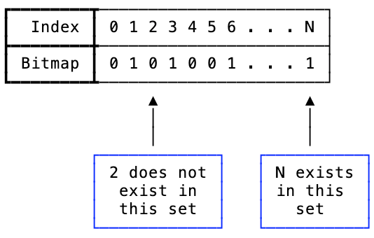

---
---

# Principle

## 什么是位图

### 最简单位图

位图 (Bitmap, 也称为 bitset 或 bit vector) 是由二进制位组成的数组，用于存储整数集合

即第 0 个比特表示数字 0，第 1 个比特表示数字 1，以此类推。如果某个数位于原集合内，就将它对应的位图内的比特置为 1，否则保持为 0。

> 问：给定含有 40 亿个不重复的位于$[0, 2^32 - 1]$区间内的整数的集合，如何快速判定某个数是否在该集合内？
>
> 答：仅需要占用 512MB 的内存存储一个位图，对需要判定的数据进行与操作即可

由于位图只是二进制数组，因此能够借助 CPU 中极快的按位与(bitwise-AND)和按位或(bitwise-OR)指令，高效计算集合的交集与并集。
位图的操作速度相当之快。

但是，位图也不是完美无缺的。
不管业务中实际的元素基数有多少，它占用的内存空间都恒定不变。

> 问：若40亿个不重复的位于$[0, 2^32 - 1]$区间内的整数的集合里，只有 0 在集合内，那么它应该占多少内存？
>
> 答：虽然该位图只有最低位是 1，其他位全为 0，它仍然会占用 512MB 内存。位图的数据越稀疏，空间浪费越严重。

为了解决位图不适应稀疏存储的问题，我们需要优化压缩。

### 优化压缩

大佬们提出了多种算法对稀疏位图进行压缩，以期减少内存占用并提高效率。

比较有代表性的有

- 甲骨文的 BBC。尽管压缩率不错，但由于过多的分支判断，其速度远慢于更新的方案
- WAH(Word Aligned Hybrid Compression Scheme)。BBC 的改进，基于[游程编码(Run-length encoding, RLE)](https://en.wikipedia.org/wiki/Run-length_encoding)做压缩，但有专利限制
- Concise(Compressed ‘n’ Composable Integer Set)，WAH 的变体。在某些特定情况下，它的压缩率远优于 WAH（最高可达 2 倍），但速度通常较慢
- EWAH(Extended WAH)。既无专利限制，速度也快于上述所有格式。缺点是压缩率稍逊一筹

由于基于游程压缩，他们都有个绕不开的问题：不支持随机访问。若要检查某个值是否存在于集合中，必须从头开始“解压缩”全部数据

## RoaringBitmap

RoaringBitmap 实践中主要使用了分桶，并按照可能出现的分布进行了更为细致的划分：

1. 将 32-bit 的范围 ($[0, n)$) 划分为 $2^{16}$ 个桶，每一个桶有一个容器；
2. 将数值 $k$ 划分为高 16 位($\lfloor\frac{k}{2^{16}}\rfloor$)和低 16 位($k\bmod 2^{16}$)；
3. 进行数据存储时，会先根据高 16 位二分查找找到对应的索引 key，低16位作为 key 对应的 value，先通过 key 检查对应的容器，如果发现容器不存在的话，就先创建一个 key 和对应的容器，否则直接将低 16 位存储到对应的容器中。

RoaringBitmap 的精妙之处就在于其对容器的划分和设计。
